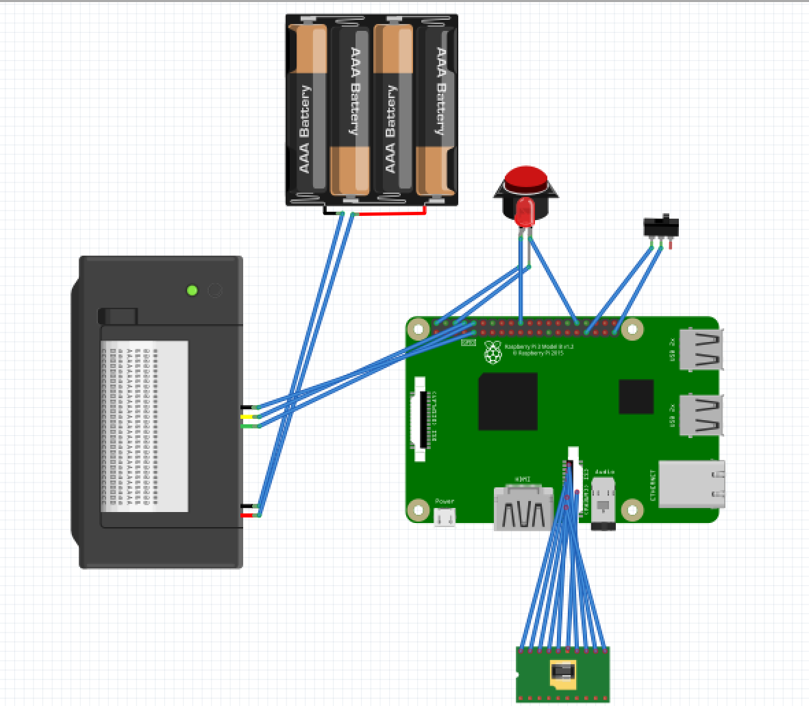

# Pi Camera 
### An new take on an old style

The goal of the project was to create a camera that mimicked an older style camera while still having some modern features that are quite different from what would've been seen in the past. The camera that I designed was a useless project that prompted the user to think about the output of the camera. This was due to the thermal printer printing what the camera saw as an output in text form. 

First, the picture is taken by the user and instead of simply printing a picture, image is processed by a [AI Clip Interrogator](https://github.com/pharmapsychotic/clip-interrogator) that results in a description the image just how a computer would in order to replicate it. Then, the text is ran through the [stable diffusion model](https://github.com/CompVis/stable-diffusion), [through the Dream Studio API](https://beta.dreamstudio.ai/), in order to generate the images that a computer would see. The images are thenuploaded to [Imgur](https://imgur.com/) and then the images and a qr code with the link to the images are printed for the user to see. 

## Required Materials: 
------
1. [Raspberry Pi 3B+](https://www.adafruit.com/product/3775)
2. [ArduCam 64MP Raspberry Pi Camera](https://www.arducam.com/64mp-ultra-high-res-camera-raspberry-pi/)
3. [Thermal Printer(and required accessories)](https://www.adafruit.com/product/597)
4. [SPDT Toggle Switch](https://www.adafruit.com/product/3221)
5. [Arcade Button with LED ](https://www.adafruit.com/product/3430)
6. Powersource, wires, housing and other similar materials 

## Wiring:
------ 
1. Power thermal printer and Raspberry Pi with the power source. In this project, the original power cable from the thermal printer was spliced and connected to a usb-B 3.0 cable and then connected to a powerbank. Make sure there is enough voltage for the raspberry pi and the thermal printer(5v).
2. Connect the Pi Camera to the Camera input on the Raspberry Pi. 
3. Connect the TX on the printer to the RX header on the Raspberry Pi and then connect the TX on the printer to the RX on the Raspberry Pi. The ground can be connected to any ground header on the raspberry pi. 
4. Connect the middle pin of the Toggle Switch to a ground header on the Raspberry Pi. Next, connect one of the ON pins of the Toggle Switch to GPIO Pin #13 on the Raspberry Pi. 
5. First, connect one of the inner pins to any ground pin on the Raspberry Pi. Next, connect the other end to GPIO Pin #12 on the Raspberry Pi. 
6. This project utilized an incorrect way of wiring the LED but both methods are shown here. Both approaches work but the first is the correct one while the second may damage the Raspberry Pi.
    1. Option 1, correct approach
        1. Connect the anode of the LED Arcade button to a 5v header on the Raspberry Pi. This is required since the LEDs are 5v. 
        2. Connect an NPN transistor with the cathode of the LED Arcade button on an N terminal. 
        3. Connect the P terminal to the GPIO Pin #23 on the Raspberry Pi. 
        4. Connect the empty N terminal to a ground pin on the Raspberry Pi.  
    2. Option 2, incorrect approach. May damage the Raspberry Pi. 
        1. Connect the anode of the LED Arcade button to a 5v header on the Raspberry Pi. This is required since the LEDs are 5v. 
        2. Connect the cathode of the LED Arcade button to the GPIO Pin #23 on the Raspberry Pi.

## Code: 
------
In order to run this code, you need to obtain an API key for [Dream Studio](https://platform.stability.ai/docs/getting-started/authentication) and [Replicate](https://replicate.com/docs/get-started/python#authenticate). Paste the Dream Studio/ Stability API token on `line 23` in `predict.py` and the Replicate Token on `line 24` in `predict.py`.  
Now, upload the code to the Raspberry Pi and make sure everything is connected as listed above. You can now run the code with `python predict.py` and wait until the Arcade Button LED is on. Once its on, aim your camera and take a picture! If the switch is in the on position, a text interpretation and qr code to the see images is printed, but if the switch is in the off position, the image taken and the computer rendering will be printed along with the same qr code to the imgur link. 

## Other Links: 
* [Original Proposal](https://docs.google.com/presentation/d/1aYstJ0G2Fg-Bk03LoDEcICl-ishT3CIbPRFDL4NeB2E/edit#slide=id.p)
* [First Prototype](https://docs.google.com/document/d/1zMuN2FoyEu2WlAjWtQQX2DENBniZJCucgUigKJtUFb4/edit#heading=h.yzdpokwibilk)
* 

### Images: 
------
|  | 
|:--:| 
| *The inner wiring of the Raspberry Pi. I used a terminal hat to make a semi-permanent solution without soldering.* |

|  | 
|:--:| 
| *The inner wiring of the Raspberry Pi. I used a terminal hat to make a semi-permanent solution without soldering.* |

|  | 
|:--:| 
| *I soldered the button connections. I had previously soldered a few items on a PCB but a button like this was a new experience for me. The back right black/ground cable was one of my better solder points* |

|  | 
|:--:| 
| *I also soldered the switch connections.* |

|  | 
|:--:| 
| *The camera is attached to the front of box with screws while the ribbon cable is connected to the camera port on the Raspberry Pi.* |

|  | 
|:--:| 
| *In order to make semi-permenent connections I utilized [Wago 221 Lever Connectors](https://www.wago.com/us/discover-wire-and-splicing-connectors/221) to connect wires such as the printers power connection* |

|  | 
|:--:| 
| *Close up of the terminal hat for the Raspberry Pi* |

|  | 
|:--:| 
| *The inside of the Raspberry Pi fully assembled.* |

|  | 
|:--:| 
| *The top of the Pi Camera with printer, button and switch.* |

|  | 
|:--:| 
| *The front of the Pi Camera with the camera module.* |

|  | 
|:--:| 
| *The hinges to make the opening of the camera. Hot Glue/Silicone was added to the protruding screws since I did not have cutter available.* |

|  | 
|:--:| 
| *A 1/4 tripod compatible screw-in mount was added, this came with the ArduCam as a case but was reused as the tripod mount* |

|  | 
|:--:| 
| *The sample text printout with qr code at the bottom* |

|  | 
|:--:| 
| *The sample image mode printout wiht qr code at the bottom* |

<!-- 
|  |
| *Old Camera* | -->

